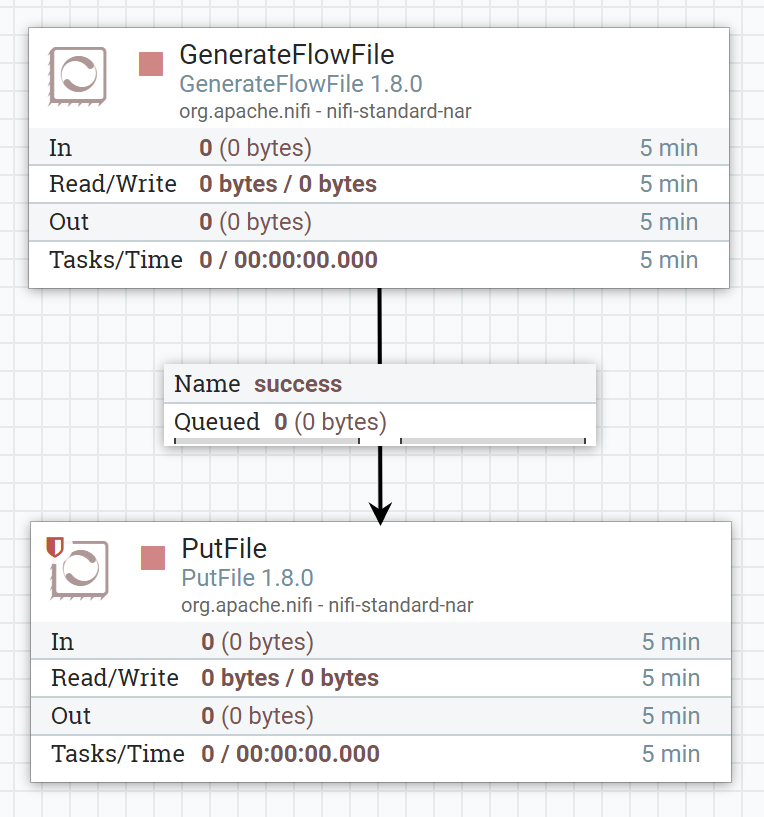

# EJEMPLO 1

Utilizamo este sencillo ejemplo para explicar un poco el funcionamiento de Apache NiFi. El desarrollo de todo el ejemplo se encuentra en el docuemnto de *Apache NiFi. Breve introducción*.

El ejemplo consta simplemente de dos procesadores: **GenerateFlowFile** que nos genera flowfiles de forma automática y **PutFile** que los escribirá en la ruta seleccionada.

