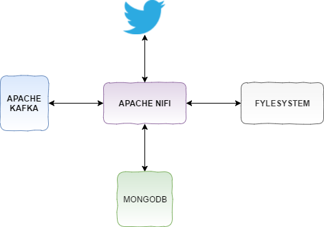
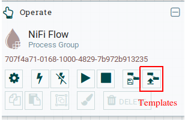
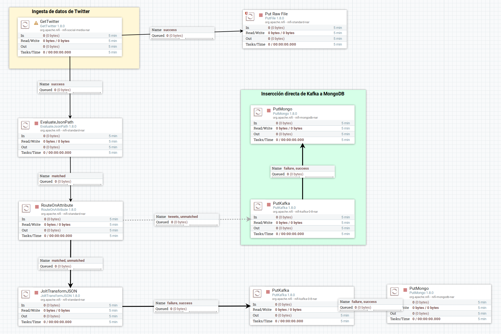

# Prueba de Integración Twitter - Apache Kafka - MongoDB.

En esta prueba veremos como podemos manejar datos de forma sencilla entre los diferentes componentes que aparecen en el siguiente esquema:




Antes de comenzar a probar el entorno de pruebas deberemos levantar los diferentes componentes que necesitamos desde el docker-compose. Para ello:

```bash
vthot4@proton:~/NIFI/poc_nifi/examples/Twitter_Kafka_MongoDB$ docker-compose -f docker-compose.yml up -d
vthot4@proton:~/NIFI/poc_nifi/examples/Twitter_Kafka_MongoDB$ docker-compose -f docker-compose.yml ps
         Name                       Command               State                      Ports
-------------------------------------------------------------------------------------------------------------
Poc_nifi_kafka           /etc/confluent/docker/run        Up      0.0.0.0:9092->9092/tcp
Poc_nifi_mongo_express   tini -- /docker-entrypoint ...   Up      0.0.0.0:8081->8081/tcp
Poc_nifi_mongodb         docker-entrypoint.sh mongod      Up      0.0.0.0:27017->27017/tcp
Poc_nifi_nifi            ../scripts/start.sh              Up      10000/tcp, 0.0.0.0:8080->8080/tcp, 8443/tcp
Poc_nifi_zookeeper       /etc/confluent/docker/run        Up      2181/tcp, 2888/tcp, 3888/tcp
```

*( En el enlace de  [Operacion](./Ope_Entorno.md) podemos ver un poco más sobre la operación de este entornno. )*

Una vez que tengamos todo levantado tendremos accesibless los productos en los siguientes puertos:

- **MongoDB:** 27017
- **Mongo Express:** http://localhost:8081  (user:admin/admin)
- **ZooKeeper:** 2181
- **kafka:** 9092
- **Nifi:** http://localhost:8080


Para cargar nuestro ejemplo de prueba vamos a usar las opciones de templates del cuadro de *"operate"* de Nifi. Primeramente importaremos la plantilla del ejemplo. El fichero que debemos importar es: **Twitter-kafka-MongoDB.xml**  

 

Una vez importado sólo tenemos que añadir el template desde el menu superior.


Una vez añadido nos aparecerá el flujo general de la prueba:




Hasta aqui, ya tendremos el entorno de pruebas preparado para conmenzar. Los pasos a realizar serían:

1. Configurar el procesador de Twitter.
2. Comenzar la ingesta de datos.
3. Comprobar la usabilidad y posibilidades de Apache NiFi.

Todas estas explicaciones quedan recogidas en el documento de **Apache NiFi. Breve introducción"**, disponible en el siguiente enlace:
